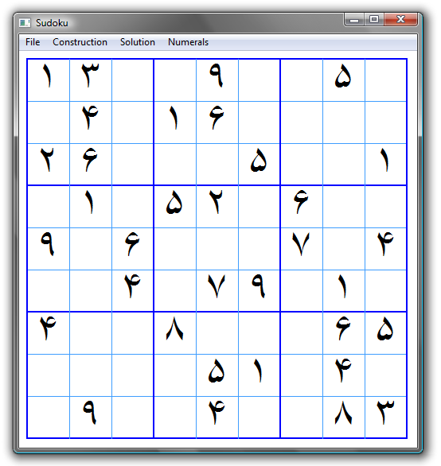

Sudoku
------------

Sudoku is a tool for solving, creating, and publishing Sudoku puzzles. You can save puzzles as SVG files. There is support for all of the numerical symbols in the Basic Multilingual Plane of the Unicode Standard (5.1). This would be helpful if you were developing Sudoku puzzles for non-Western peoples—or if you're practicing your numerals.



*   Open & Save
    *   _File|Save_ to save the current puzzle
    *   _File|Open_ to open a saved puzzle (file format: 81 numbers that will fill the grid row-by-row, 1-9, or -1 for blanks)
*   Printing and publishing
    *   _File|Save SVG without answers_ to create an SVG file (widely readable format) without the answers)
    *   _File|Save SVG with answers_ to create an SVG file (widely readable format) with the answers (e.g., a solution key)
*   Creating puzzles
    *   To modify a puzzle, click a cell to select it. Enter a number 1 through 9, or click the spacebar to clear the cell
    *   _Construction|Build completed puzzle_ for a randomly-filled solved puzzle (from which you can work backwards by eliminating cells)
    *   _Construction|Clear all_ to clear the whole puzzle
    *   See _Solution|Sove with report_ to check your work
*   Solving puzzles
    *   Click _Solution|Solve_ to solve the puzzle
    *   Or _Solution|Step_ to see a single solution step
    *   _Solution|Clear solution_ to clear the solution away
    *   _Solution|Sove with report_ for something of an evaluation of the difficulty of the puzzle: the percentage of deducible moves per empty squares, over the course of the game. The easiest puzzle would be a line at 100% for the whole game (i.e., every square can be solved on every step). The hardest puzzles will have several points where the line touches 0% (i.e., when there's no way to deduce the answer, and you have to work it out both ways).
*   Internationalization
    *   _Numerals| ..._ to choose a set of numerals for the puzzle
    *   Note that you may have to do _Numerals|Choose font..._ to select a font that has the glyphs. This program just requests the proper symbol; you need the proper font to show the symbol.
*   My wife told me that if I wrote this program I would never play Sudoku again. She was just about right.

Downloads
---------

Sudoku is created with the [Qt application framework](https://www.qt.io/), released under the GNU Public License. That means, among other things, that you are free to download it and use it, but not to re-sell it.

Qt is a cross-platform framework, so there is the possibility for using this on Mac OS X, Linux, etc. Right now I only have Windows executables because I only have a Windows machine. Perhaps some do-gooder will build versions for other operating systems and send them to me.

I build in Windows with this, which assumes that Qt is installed and visible in your path:

```
qmake -config release
mingw32-make
```

Of course your system would have something different from “mingw32-make”—probably just “make”—if you are not building from Windows using MinGW.
